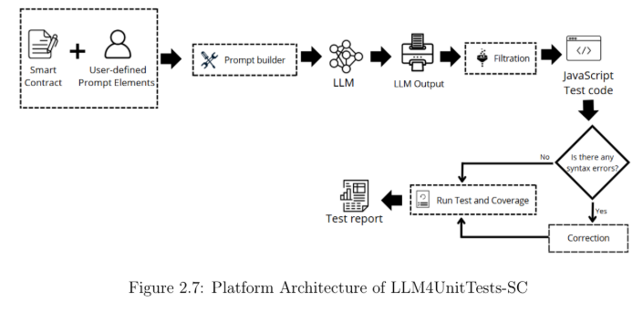
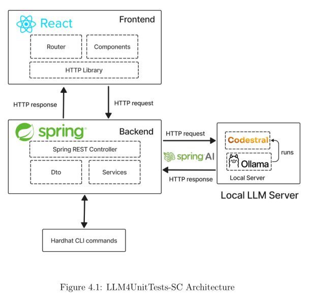

# LLM4UnitTests-SC

## Overview
LLM4UnitTests-SC is a tool that automates **unit test generation and validation for smart contracts**. This project is a **Spring Boot application** that integrates **Spring AI** with **Ollama** and **Hardhat** and can be integrated as a **plugin** in **VSCode**, **Intellij** and **Remix** 

It serves as a backend system capable of:
- Generating Solidity unit tests using LLMs (via Ollama models like Codestral, Llama or Deepseek)
- Validating generated tests through Hardhat
- Managing prompts and requests through structured REST APIs
LLM4UnitTests-SC is a fullstack application for automatically generating unit tests for smart contracts using Large Language Models (LLMs). Users upload Solidity smart contracts along with relevant context files (e.g., testing instructions, context, requirements), and the app generates unit tests based on the input.

---
## Platform Architecture

<p align="center">
  
</p>

**Figure:** End-to-end flow of LLM4UnitTests-SC showing prompt construction, LLM inference, syntax validation, correction, and test reporting.

---

## System Architecture

<p align="center">
  
</p>

**Figure:** Overall architecture integrating React frontend, Spring backend, and local Ollama server running the Codestral model.

---

## Demo Video

<p align="center">
  <video src="assets/demoLLM4UnitTest_SC.mp4" controls width="700">
  </video>
</p>


## Project Structure

The repository is organized into the following main folders:

### backend  
**Description:** Spring Boot backend that processes uploaded files and communicates with a local LLM.  
**Tech Stack:** Java, Spring Boot.  
**Features:**  
- **Spring Boot Backend:** Modular REST API structure using controllers, DTOs, and services  
- **LLM Integration:** Communicates with **Ollama** to generate smart contract unit tests using Codestral, a local LLM 
- **Prompt Engineering Layer:** Dynamic prompt management and adaptation  
- **Hardhat Integration:** Automatically compiles and validates generated Solidity tests  

### frontend  
**Description:** React.js application for user interaction.  
**Tech Stack:** React.js, Axios.  
**Features:**  
- Upload Solidity smart contracts and related text files  
- Trigger and display generated unit tests  
- Simple and user-friendly UI

---

## Prerequisites

Before running the application, ensure the following are installed:

- **[Ollama](https://ollama.com/):** Local runtime for LLMs.  
- **Codestral model:** You must have the Codestral model installed in Ollama.

1. Install Ollama:  
   👉 [https://ollama.ai/download](https://ollama.ai/download)

2. Pull your preferred model:
   ```bash
   ollama pull Codestral

The choice of Codestral was made after evaluation and benchmarking of various of LLMs, as it proved to be the most efficient and effective for generating Solidity smart contract tests.


Start Ollama and load the Codestral model:

```bash
ollama serve
ollama run codestral
